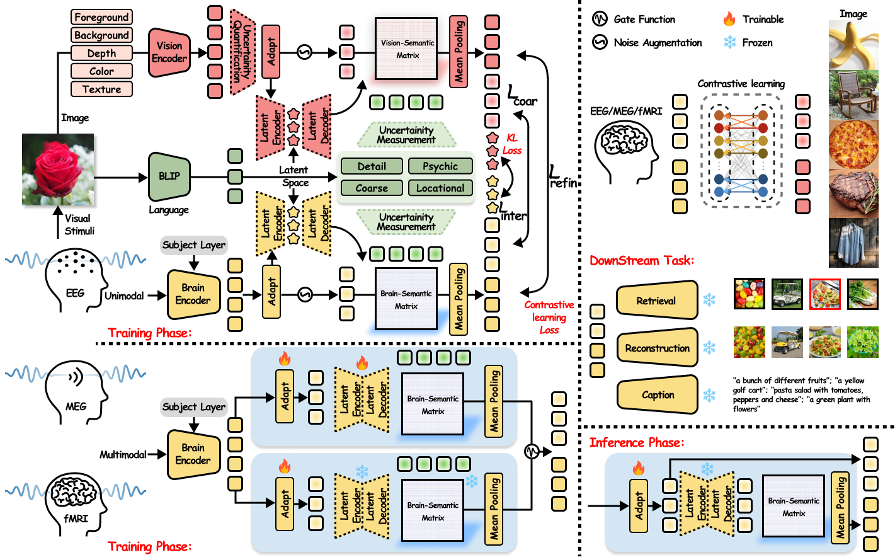
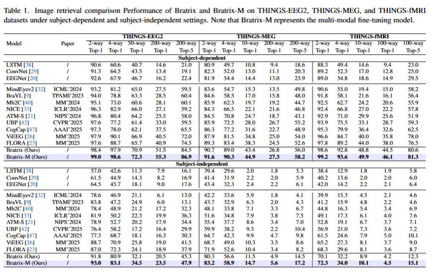

<div align="center">

<h2 style="border-bottom: 1px solid lightgray;">🧠✨👀Unveiling Deep Semantic Uncertainty Perception for Language-Anchored Multi-modal Vision-Brain Alignment</h2>
</div>


<!-- Badges and Links Section -->
<div style="display: flex; align-items: center; justify-content: center;">

<p align="center">
  <a href="#">
  <p align="center">
    <a href='https://arxiv.org/'></a>
    <a href='https://github.com/DanceSkyCode/Bratrix'> </a>
    <a href='https://huggingface.co/datasets/DanceSkyCode/Bratrix/tree/main/EEG_preprocessed_data'></a>
    <a href='https://huggingface.co/datasets/DanceSkyCode/Bratrix/tree/main/MEG_preprocessed_data'></a>
    <a href='https://huggingface.co/datasets/DanceSkyCode/Bratrix/tree/main/fMRI_preprocessed_data'></a>
    <a href='https://huggingface.co/DanceSkyCode/Bratrix/tree/main/EEG_checkpoint'></a>
    <a href='https://huggingface.co/DanceSkyCode/Bratrix/tree/main/MEG_checkpoint'></a>
    <a href='https://huggingface.co/DanceSkyCode/Bratrix/tree/main/fMRI_checkpoint'></a><br>
    <a href="https://scholar.google.com/citations?user=3G2NKeIAAAAJ&hl=zh-CN" target="_blank">Zehui Feng</a>,
    <a target="_blank">Chenqi Zhang</a>,
    <a target="_blank">Mingru Wang</a>,
    <a target="_blank">Minuo Wei</a>,
    <a href="https://homepage.zjut.edu.cn/csw/" target="_blank">Shiwei Cheng</a>,
    <a href="https://scholar.google.com/citations?user=sg4vxPoAAAAJ&hl=en" target="_blank">Cuntai Guan*</a>,
    <a href="https://www.scopus.com/authid/detail.uri?authorId=55425962400" target="_blank">Ting Han*</a>,
    <br>
    Shanghai Jiao Tong University, Nanyang Technology University, Zhejiang University, Zhejiang University of Technology
    * denotes the corresponding author
  </p>
</p>


</div>

<br/>


<div align="center">
<!--  -->
<div>
  
</div>

</div>

Overview of multimodal decoding paradigms.

<div align="center">
<div>

</div>
</div>

Overall architecture of Bratrix.

<div align="center">
<div>

</div>
</div>

Overall comparison performance of Bratrix.


<!-- ## News -->
<h2 style="border-bottom: 1px solid lightgray; margin-bottom: 5px;">✨ Update</h2>

* **2025/10/07** 💻💻💻 we are ready to release EEG/MEG/fMRI model weight.
* **2025/09/30** 💻💻💻 we release training and evaluation code.
* **2025/09/29** 🖼️🖼️🖼️ We release all pre-processed dataset
* **2025/09/28** 🖼️🖼️🖼️ we release all raw dataset.


<!-- ## Environment setup -->
<h2 style="border-bottom: 1px solid lightgray; margin-bottom: 5px;">🔧Environment setup</h2>

quickly create a conda environment that contains the packages necessary to run our scripts.

```
conda create -n Bratrix python=3.10
conda activate Bratrix
pip install -r requirements.txt
```
<h2 style="border-bottom: 1px solid lightgray; margin-bottom: 5px;">🐰 Raw Datset and Preprocessed Dataset Download</h2>

| Dataset | Dataset | Dataset | Dataset |
|---------|---------|---------|---------|
| **THINGS-EEG1**<br>[Download](https://openneuro.org/datasets/ds003825/versions/1.1.0) | **THINGS-EEG2**<br>[Download](https://osf.io/3jk45/) | **THINGS-MEG**<br>[Download](https://openneuro.org/datasets/ds004212/versions/2.0.0) | **THINGS-fMRI**<br>[Download](https://openneuro.org/datasets/ds004192/versions/1.0.7) |
| **THINGS-Images**<br>[Download](https://osf.io/rdxy2) | **Preprocessed-EEG**<br>[Download](https://huggingface.co/) | **Preprocessed-MEG**<br>[Download](https://huggingface.co/) | **Preprocessed-fMRI**<br>[Download](https://huggingface.co/) |


<!-- We will release the processed data (such as THINGS-EEG1, THINGS-EEG2, THINGS-MEG, THINGS-fMRI) on [Huggingface], which can be directly used for training.
 -->


<!-- ## Quick training and test  -->
<h2 style="border-bottom: 1px solid lightgray; margin-bottom: 5px;">🚀Quick training and test</h2>


#### 1.Visual Retrieval
We provide the script to train the end-to-end Bratrix for ``subject-dependent training`` in *THINGS-EEG2* dataset. Please modify your data set path and run:
```
python Bratrix-eeg.py --data_path your_preprocessed_EEG_data_path --gpu cuda:0  --insubject True --subjects ['sub-01', 'sub-02', 'sub-03', 'sub-04', 'sub-05', 'sub-06', 'sub-07', 'sub-08', 'sub-09', 'sub-10']
```
Or you can train the end-to-end Bratrix for ``subject-dependent training`` in single subject ``subject-01`` in *THINGS-EEG2* dataset.
```
python Bratrix-eeg.py --data_path your_preprocessed_EEG_data_path --gpu cuda:0  --insubject True --subjects ['sub-01']
```
Also, you can train the Bratrix for ``subject-independent training`` setting
```
python Bratrix-eeg.py --data_path your_preprocessed_EEG_data_path --gpu cuda:0  --insubject False --subjects ['sub-01', 'sub-02', 'sub-03', 'sub-04', 'sub-05', 'sub-06', 'sub-07', 'sub-08', 'sub-09', 'sub-10']
```
Similarily, we provide the training and evaluation code for MEG and fMRI modalities in *THINGS-MEG* dataset and *THINGS-fMRI* dataset 
```
python Bratrix-meg.py --data_path your_preprocessed_MEG_data_path --gpu cuda:0  --insubject True --subjects ['sub-01', 'sub-02', 'sub-03', 'sub-04']
```
```
python Bratrix-fmri.py --data_path your_preprocessed_fmri_data_path --gpu cuda:0  --insubject True --subjects ['sub-01', 'sub-02', 'sub-03']
```
#### 2.Multi-modal Fine-Tuning
For example, you can per-train the 10-subject Bratrix-EEG model, and then you can fine-tune it in Bratrix-fMRI:
```
python Bratrix-eeg-10subject.py --data_path your_preprocessed_eeg_data_path --gpu cuda:0  --insubject True --subjects ['sub-01', 'sub-02', 'sub-03', 'sub-04', 'sub-05', 'sub-06', 'sub-07', 'sub-08', 'sub-09', 'sub-10']
python python Bratrix-fmri-multi.py --data_path your_preprocessed_fmri_data_path --gpu cuda:0  --insubject True --subjects ['sub-01', 'sub-02', 'sub-03', 'sub-04']
```

#### 3.Visual Reconstruction
We provide the end-to-end training and inference scripts for visual reconstruction. Please modify your data set path and run zero-shot on test dataset. Note that the image features come from CLIP (ViT-L-14) rather than our Vision Encoder. But the EEG feature representation still comes from per-trained Bratrix Brain Encoder.
```
python Bratrix-eeg-image-generation.py --data_path your_preprocessed_EEG_data_path --gpu cuda:0  --insubject False --subjects ['sub-01', 'sub-02', 'sub-03', 'sub-04', 'sub-05', 'sub-06', 'sub-07', 'sub-08', 'sub-09', 'sub-10'] --checkpoint_path your_per-trained_aligned_checkpoint
```
#### 4.Visual Captioning

We followed MindEye and BrainFLORA scripts for visual caption generation downstream task.
```
# get caption from prior latent
python Bratrix-caption_feature_generation_stage_1.py --data_path your_preprocessed_EEG_data_path --gpu cuda:0  --insubject False --subjects ['sub-01']
# fine-tuning and inference caption results
python Bratrix-caption_generation_stage_2.py
```

<!-- ## Acknowledge -->
<h2 style="border-bottom: 1px solid lightgray; margin-bottom: 5px;">😺Acknowledge</h2>

We sincerely thank the following outstanding works and contributors:  


1. **THINGS-EEG2 dataset** — *A large and rich EEG dataset for modeling human visual object recognition*.  
   Authors: Alessandro T. Gifford, Kshitij Dwivedi, Gemma Roig, Radoslaw M. Cichy.  

2. **THINGS-data** — a multimodal dataset for investigating object representations in the human brain and behavior.  
   Authors: Hebart, Martin N., Oliver Contier, Lina Teichmann, Adam H. Rockter, Charles Y. Zheng, Alexis Kidder, Anna Corriveau, Maryam Vaziri-Pashkam, and Chris I. Baker.  

3. **EEG decoding and neural embedding works** — for inspiring dataset preprocessing and neural network design:  
   - Decoding Natural Images from EEG for Object Recognition, Yonghao Song, Bingchuan Liu, Xiang Li, Nanlin Shi, Yijun Wang, Xiaorong Gao.  
   - BrainFLORA: Uncovering Brain Concept Representation via Multimodal Neural Embeddings, Dongyang Li, Haoyang Qin, Mingyang Wu, Chen Wei, Quanying Liu.  
   - UMBRAE: Unified Multimodal Brain Decoding, Xia, Weihao and de Charette, Raoul and Oztireli, Cengiz and Xue, Jing-Hao.

---

# 🏷️ License
This repository is released under the MIT license. See [LICENSE](./LICENSE) for additional details.